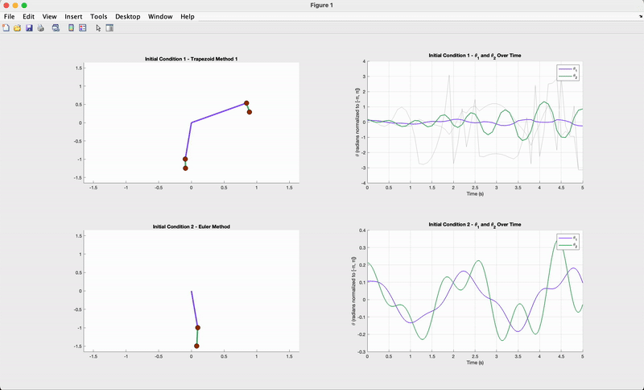
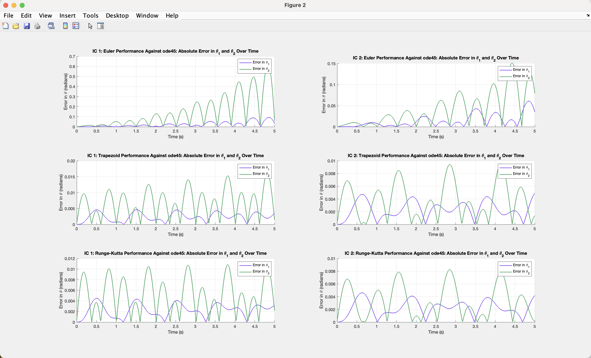

# Double Pendulum Dynamical System

Last revised March 12th

## Three integration methods:
1. Euler Method
2. Trapezoid Method
3. Runge-Kutta Method

## Running the Simulation

In MATLAB, run `LastnameFirstnameEC.m`. This file will generate several figures comparing the simulated trajectories of a double pendulum with fixed initial conditions across 6 different instances. There will be 2 simulations run for each of the 3 integration methods, each with a different initial `L2` length and `t_step` precision:

1. *Figure 1* **Simulation** - The left column shows animations of the simulated trajectories. The right column plots $$\theta_1$$ and $$\theta_2$$ over time. The top row corresponds to initial conditions 1, and the bottom corresponds to initial conditions 2.
2. *Figure 2* **Performance** - Each cell plots the absolute difference of $$\theta_1$$ and $$\theta_2$$ between the above three integration methods and MATLAB's ode45 differential equation solver.

_Notes_: 
- _For less chaotic results, use a smaller `t_step` value (This can be adjusted in `LastnameFirstnameEC.m`)._
- _Some initial conditions cause the pendulum to spin sporadically, resulting in values of_ $$\theta_1$$ _and_ $$\theta_2$$ _that are difficult to visualize. To counteract this, the right column of `Figure 1` — the_ $$\theta$$_/Time plots — has been normalized to [-π, π] [Might remove]._

## Project Files:

1. *Function* `EOM.m` - Contains two nested functions, `M1AA.m` and `M2AA.m`, both of which calculate angular momentum $$\ddot{\theta_{i}}$$ of $$\theta_{i}$$ given the current values of $$\theta_{1}$$, $$\dot{\theta_{1}}$$, $$\theta_{2}$$, $\dot{\theta_{2}}$ at the $n$-th state.

2. *Function* `RungeKutta.m` - Calculates the $$(n+1)$$-th state values of $$\theta_{1}$$, $$\dot{\theta_{1}}$$, $$\theta_{2}$$, $$\dot{\theta_{2}}$$ given them at the $$n$$-th state. Takes the weighted average of the intermediate slopes $$k_{1}$$ through $$k_{4}$$. Calls `M1AA.m` and `M2AA.m`.

3. *Function* `Trapezoid.m` - Calculates the $$(n+1)$$-th state values of $$\theta_{1}$$, $$\dot{\theta_{1}}$$, $$\theta_{2}$$, $$\dot{\theta_{2}}$$ given them at the $$n$$-th state. Takes the average of the slopes at the start and end of each time interval. Calls `M1AA.m` and `M2AA.m`.

4. *Function* `Euler.m` - Calculates the $$(n+1)$$-th state values of $$\theta_{1}$$, $$\dot{\theta_{1}}$$, $$\theta_{2}$$, $$\dot{\theta_{2}}$$ given them at the $$n$$-th state. Calls `M1AA.m` and `M2AA.m`

5. *Function* `ODE45.m` - Calculates the $$(n+1)$$-th state values of $$\theta_{1}$$, $$\dot{\theta_{1}}$$, $$\theta_{2}$$, $$\dot{\theta_{2}}$$ given them at the $$n$$-th state using MATLAB's ode45 differential equation solver. Calls `M1AA.m` and `M2AA.m`

6. *Class* `simulation.m` - Instantiates a simulation object from an initial pendulum state with the provided initial condition and other system values. Calculates iterative state values for a set duration. Calls either `euler_method.m`, `trapezoid_method.m`, `runge_kutta_method.m`, or `ode45_method.m`, depending on which integration function is passed as an object parameter during initialization. Plots $$\theta_1$$ and $$\theta_2$$ over time, the performance of each integration method, and an animation of the simulation.

7. *Class* `state.m` - Represents the values of $$\theta_{1}$$, $$\dot{\theta_{1}}$$, $$\theta_{2}$$, $$\dot{\theta_{2}}$$ at any given state.

8. *Main Script* `LastnameFirstnameEC.m` - Calls `simulation.m` to construct various double pendulum simulations with predefined initial states and plot the corresponding generated animations.

## Output

### Example Figure 1:

    

### Example Figure 2:

    

